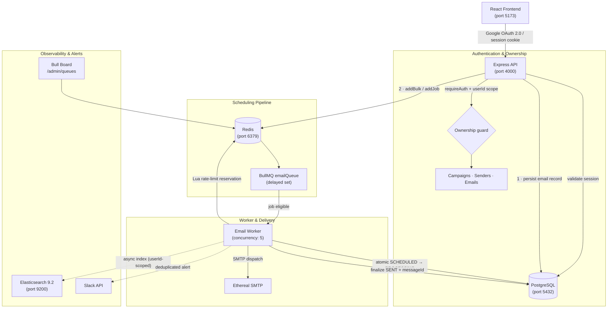

# ReachInbox Email Scheduler

A distributed email scheduling system built with TypeScript, Express, PostgreSQL, BullMQ, Redis, Elasticsearch, and React. Designed around durable delayed job execution, atomic rate limiting, multi-tenant isolation, and resilient crash-boundary handling between SMTP and the database.


---

## Table of Contents

- [Overview](#overview)
- [Key Features](#key-features)
- [Screenshots](#screenshots)
- [Architecture](#architecture)
- [How Scheduling Works](#how-scheduling-works)
- [Delivery Reliability & Crash Boundaries](#delivery-reliability--crash-boundaries)
- [Rate Limiting & Concurrency](#rate-limiting--concurrency)
- [Elasticsearch Search](#elasticsearch-search)
- [Bulk Scheduling & Scale](#bulk-scheduling--scale)
- [Tech Stack](#tech-stack)
- [Engineering Rationale](#engineering-rationale)
- [Local Setup](#local-setup)
- [Environment Variables](#environment-variables)
- [Database Schema](#database-schema)
- [Running the Worker](#running-the-worker)
- [API Reference](#api-reference)
- [Testing & Verification](#testing--verification)
- [Bull Board Dashboard](#bull-board-dashboard)
- [Google OAuth Setup](#google-oauth-setup)
- [Slack OAuth & Alert Setup](#slack-oauth--alert-setup)
- [Known Limitations](#known-limitations)

---

## Overview

ReachInbox Email Scheduler is a backend-focused project that addresses the practical challenges of scheduling and dispatching large volumes of outbound email reliably. The system separates the act of **scheduling** (user-facing, synchronous) from **delivery** (worker-driven, asynchronous), with PostgreSQL serving as the single authoritative source of state throughout.

Emails are persisted to PostgreSQL before any job is created, ensuring no message is silently lost if the queue or worker restarts. BullMQ stores delayed job references in Redis; when a job becomes eligible, a worker process picks it up, applies per-sender and per-campaign rate limits atomically in Redis using a Lua script, claims the database record with a concurrency-safe `updateMany`, and finally dispatches via SMTP. The lifecycle ends with PostgreSQL updated to `SENT` and an asynchronous Elasticsearch indexing step that does not block delivery.

The frontend is a React + Tailwind dashboard that exposes scheduling, search, status monitoring, and Slack integration through a clean single-page interface authenticated via Google OAuth.

---

## Key Features

### Scheduling & Delivery

- **Delayed scheduling** — emails are scheduled for any future timestamp; BullMQ holds them in Redis delayed sets until they are due
- **Bulk scheduling** — `POST /api/emails/schedule-batch` accepts arrays of email inputs and inserts them in chunked PostgreSQL writes followed by a single `addBulk` call to Redis
- **Configurable inter-email delay** — a minimum send delay (default: 2,000 ms) is enforced per sender via Redis to prevent burst sending
- **Hourly rate limits** — per-sender and per-campaign hourly quotas configurable at request time; defaults enforced via `MAX_EMAILS_PER_HOUR`
- **File attachments** — base64-encoded attachment payloads are stored in PostgreSQL (`Json` column) and decoded by the worker before SMTP dispatch via Nodemailer

### Reliability

- **PostgreSQL-first persistence** — email records are written to PostgreSQL before any BullMQ job is created; the database is always the authoritative source of state
- **Deterministic job IDs** — BullMQ job IDs follow the pattern `email_<emailId>`, preventing duplicate job creation on retry or re-enqueue
- **Atomic worker claims** — the `SCHEDULED → PROCESSING` transition uses `prisma.email.updateMany` scoped to `status = 'SCHEDULED'`; only the worker that receives `count === 1` proceeds
- **Restart-safe job persistence** — BullMQ delayed jobs survive Redis and worker restarts because job state is stored in Redis sorted sets, not in memory
- **SMTP/database crash-boundary handling** — if a worker is interrupted after SMTP acceptance but before PostgreSQL finalization, the record is preserved in `PROCESSING` with a note rather than silently re-dispatched (see [Delivery Reliability](#delivery-reliability--crash-boundaries))
- **Durable Message-ID recovery** — if `messageId` is already populated on a `PROCESSING` record, the worker finalizes to `SENT` without re-sending
- **Configurable retry** — BullMQ retries are configured per job; `FAILED` status is written to PostgreSQL only after all attempts are exhausted

### Platform

- **Google OAuth 2.0** — PKCE-style state parameter (32-byte random, stored in Redis with 10-minute TTL, single-use) protects the login flow; sessions are server-side 7-day HttpOnly cookies stored in PostgreSQL
- **Multi-tenant ownership isolation** — every API endpoint enforces `userId` scoping at the query layer; no cross-user data access is possible through the application API
- **Elasticsearch full-text search** — emails are indexed asynchronously after delivery; search is scoped by `userId` using a term filter in every query
- **Bull Board** — real-time BullMQ queue observability mounted at `/admin/queues`
- **Slack rate-limit notifications** — when a sender's hourly quota is hit, the worker fires a Slack message to the connected workspace; a Redis `SET NX EX 3600` key deduplicates alerts within the same hour

---

## Screenshots

> **TODO:** The repository currently contains only small placeholder assets under `frontend/public/`. Add real application screenshots (Login, Dashboard, Compose, Scheduled/Sent list, Email Detail Modal) and update this section with correct relative paths, for example:
>
> ```markdown
> 
> 
> ```

---

## Architecture



---

## How Scheduling Works

1. **Request received** — the authenticated user sends a `POST /api/emails/schedule` or `POST /api/emails/schedule-batch` request
2. **Ownership enforced** — the API resolves the sender and campaign, verifying both belong to the authenticated `userId`
3. **Email record created** — a row is inserted into PostgreSQL with `status = 'SCHEDULED'` and the target `scheduledAt` timestamp; this is the authoritative record
4. **BullMQ job created** — a delayed job is added to the `emailQueue` using a deterministic ID (`email_<emailId>`) and a delay calculated as `scheduledAt - now`
5. **Worker picks up the job** — when the delay elapses, BullMQ delivers the job to an available worker process
6. **Rate limit checked atomically** — a Redis Lua script checks the minimum send delay and the hourly sender/campaign quota in a single atomic operation; if rejected, the job is moved back to delayed state via `job.moveToDelayed()` and a `DelayedError` is thrown (no failure counter increment)
7. **Atomic database claim** — the worker transitions the record from `SCHEDULED` to `PROCESSING` using `updateMany` scoped to `status = 'SCHEDULED'`; only the worker that receives `count === 1` continues
8. **SMTP dispatch** — Nodemailer sends the email through the configured SMTP transport; the call is synchronous from the worker's perspective
9. **Database finalized** — PostgreSQL is updated to `status = 'SENT'` with the durable `messageId` returned by the SMTP server
10. **Elasticsearch indexed** — the email document is indexed asynchronously; errors here are caught and logged but never interrupt delivery or fail the job

---

## Delivery Reliability & Crash Boundaries

Standard SMTP does not provide a distributed two-phase commit with PostgreSQL. This system explicitly acknowledges that boundary and handles it conservatively.

### Deterministic job IDs

BullMQ jobs are created with `jobId: email_<emailId>`. If the API process crashes between database write and job creation, re-running the schedule call with the same data will not create a duplicate database record (Prisma returns the existing row) and will not create a duplicate BullMQ job (same `jobId` is rejected as a duplicate by default).

### Atomic SCHEDULED → PROCESSING claim

```typescript
const updateResult = await prisma.email.updateMany({
  where: { id: emailId, status: 'SCHEDULED' },
  data: { status: 'PROCESSING', attempts: { increment: 1 } },
});
if (updateResult.count === 0) return; // already claimed
```

Exactly one worker succeeds per eligible job. Any other concurrent worker seeing `count === 0` exits without delivering.

### Crash mid-delivery: the ambiguous window

If a worker crashes **after SMTP accepts the message** but **before PostgreSQL is updated to `SENT`**, the record remains `PROCESSING` with `messageId = null`. On the next job attempt the worker detects this state and **does not re-dispatch**. Instead it records a note in the `error` field and preserves the record for manual review. Blind re-dispatch is intentionally avoided because it would risk sending the same email twice.

### Durable messageId recovery

If a previous execution managed to persist `messageId` before crashing during `status` update, the worker detects `messageId !== null` on a `PROCESSING` record and finalizes to `SENT` without re-sending. This covers the case where the DB write partially succeeded.

### Retry policy

SMTP failures (network errors, authentication errors) revert the record to `SCHEDULED` and re-throw, allowing BullMQ to retry with its configured backoff. After all attempts are exhausted, the record is permanently marked `FAILED`.

> **Note:** This design cannot guarantee exactly-once SMTP delivery — no standard SMTP integration can. It minimises the risk of duplicates while preserving durable state for every failure scenario.

---

## Rate Limiting & Concurrency

Rate limiting is enforced at the worker level, not the API level, using a single atomic Redis Lua script. There are no in-memory counters — every reservation is durable in Redis.

### What the script checks (in order)

1. **Minimum send delay** (`MIN_EMAIL_DELAY_MS`, default 2,000 ms) — the last send timestamp for this sender is read from Redis; if insufficient time has elapsed, the job is rescheduled to `lastSend + minDelay`
2. **Sender hourly limit** — a per-sender, per-UTC-hour counter is checked against the effective limit
3. **Campaign hourly limit** — if the campaign specifies a `hourlyLimit`, a separate per-campaign counter is checked

All three checks and the counter increments happen in a single `EVAL` call, making them atomic across all worker instances.

### Rescheduling behaviour

When any limit is exceeded, the worker:
- Reverts the database record from `PROCESSING` back to `SCHEDULED`
- Calls `job.moveToDelayed(nextAvailableTimestamp, token)` to park the job until capacity is available
- Throws `DelayedError()` — BullMQ does not count this as a failed attempt

For hourly limit events, the worker additionally fires a deduplicated Slack notification using `SET NX EX 3600` to ensure at most one alert per sender per hour.

### Worker concurrency

The worker process uses `env.WORKER_CONCURRENCY` (default: 5). Because rate limiting is Redis-based, multiple workers running in parallel coordinate correctly without shared memory.

See [`backend/src/services/rate-limit.service.ts`](backend/src/services/rate-limit.service.ts) for the full Lua script and reservation logic.

---

## Elasticsearch Search

PostgreSQL is the authoritative data store. Elasticsearch serves as a search-optimised read projection.

- **Indexing is asynchronous** — emails are indexed only after PostgreSQL commits `status = 'SENT'`; the indexing call is fire-and-forget and never blocks the worker or fails the BullMQ job
- **Outage resilience** — if Elasticsearch is unreachable, the error is caught and logged; email delivery continues unaffected
- **`userId` scoping** — every indexed document includes a `userId` keyword field; every search query injects a term filter on `userId` before executing, so all application search queries are scoped to the authenticated user's data
- **Full-text fields** — subject (boosted ×2), body, recipient, and senderEmail are indexed for multi-match fuzzy search
- **Fallback** — if Elasticsearch is unavailable the `/api/search/emails` endpoint returns an error; the main email list from PostgreSQL (`/api/emails`) is unaffected

---

## Bulk Scheduling & Scale

`POST /api/emails/schedule-batch` accepts an array of email inputs.

**Implementation:**
- Records are inserted into PostgreSQL in chunks of 250 using `prisma.email.createMany`
- All BullMQ jobs are created in a single `emailQueue.addBulk(...)` call to minimise Redis round-trips

**Observed local benchmark (Docker environment):**
- 1,000 email records persisted to PostgreSQL + 1,000 BullMQ delayed jobs created in **under 5,000 ms** (observed: ~140 ms on local hardware)
- This measures the scheduling/enqueue time only, not SMTP delivery time

---

## Tech Stack

| Layer | Technology |
|---|---|
| **Frontend** | React 18, Vite 6, TypeScript 5.x, Tailwind CSS 3.x, React Router 6, Lucide React |
| **Backend** | Node.js 18+, TypeScript 5.x, Express 4.x |
| **ORM / Database** | Prisma 6.x, PostgreSQL 17 |
| **Job Queue** | BullMQ 6.x, Bull Board 9.x |
| **Cache / Coordination** | Redis 8 (AOF persistence enabled), ioredis 6.x |
| **Search** | Elasticsearch 9.2, `@elastic/elasticsearch` 9.x |
| **Email** | Nodemailer 10.x, Ethereal SMTP |
| **Authentication** | Google OAuth 2.0 (`google-auth-library` 11.x), HttpOnly session cookies |
| **Notifications** | Slack Web API 8.x (`@slack/web-api`) |
| **Infrastructure** | Docker Compose (PostgreSQL 17, Redis 8, Elasticsearch 9.2) |
| **Validation** | Zod 3.x |

---

## Engineering Rationale

| Technology | Why it was chosen |
|---|---|
| **PostgreSQL** | Authoritative persistent state; ACID guarantees for email lifecycle transitions |
| **BullMQ + Redis** | Durable delayed job queue; sorted set semantics map directly to "deliver at timestamp"; survives worker and process restarts |
| **Redis Lua scripting** | Atomic multi-key rate-limit reservations without race conditions between concurrent workers |
| **Elasticsearch** | Inverted-index full-text search over subject, body, and recipient fields without adding `LIKE` load to PostgreSQL |
| **Ethereal SMTP** | Safe sandboxed SMTP capture for development and testing; messages are inspectable via preview URL without reaching real inboxes |
| **Separate worker process** | Decouples the HTTP API from long-running job processing; each can be scaled and restarted independently |
| **HttpOnly session cookies** | Session IDs are opaque server-side tokens stored in PostgreSQL; no JWT secrets or client-visible session data |

---

## Local Setup

### Prerequisites

| Tool | Version |
|---|---|
| Node.js | 18 or higher (tested on v24) |
| npm | 9 or higher |
| Docker | any recent version |
| Docker Compose | v2 (bundled with Docker Desktop) |

### 1 · Clone the repository

```bash
git clone https://github.com/farhan-islam-2004/ReachInbox-Scheduler.git
cd ReachInbox-Scheduler
```

### 2 · Start infrastructure

```bash
docker compose up -d
```

This starts three containers:

| Service | Port | Notes |
|---|---|---|
| PostgreSQL 17 | `5432` | User: `reachinbox`, DB: `reachinbox` |
| Redis 8 | `6379` | AOF persistence enabled |
| Elasticsearch 9.2 | `9200` | Single-node, security disabled for local dev |

### 3 · Configure and start the backend

```bash
cd backend
npm install

cp .env.example .env
# Edit .env — fill in GOOGLE_CLIENT_ID, GOOGLE_CLIENT_SECRET, ETHEREAL_USER, ETHEREAL_PASSWORD, and Slack credentials

npx prisma generate
npx prisma migrate deploy

# Development (live reload)
npm run dev

# Production build
npm run build
npm start
```

### 4 · Start the worker (separate process)

In a second terminal:

```bash
cd backend
npm run dev:worker     # development, live reload
# or
npm run start:worker   # production, compiled
```

> In development (`NODE_ENV=development`), the worker is also started automatically inside `server.ts` unless `START_WORKER=false` is set.

### 5 · Configure and start the frontend

In a third terminal:

```bash
cd frontend
npm install

cp .env.example .env
# Set VITE_API_URL=http://localhost:4000

npm run dev            # Vite dev server → http://localhost:5173
```

---

## Environment Variables

### Backend (`backend/.env`)

| Variable | Default | Description |
|---|---|---|
| `PORT` | `4000` | HTTP server port |
| `NODE_ENV` | `development` | `development` or `production` |
| `DATABASE_URL` | — | PostgreSQL connection string |
| `CORS_ORIGIN` | `http://localhost:5173` | Allowed frontend origin for CORS |
| `REDIS_HOST` | `localhost` | Redis hostname |
| `REDIS_PORT` | `6379` | Redis port |
| `WORKER_CONCURRENCY` | `5` | Number of concurrent BullMQ workers |
| `MAX_EMAILS_PER_HOUR` | `50` | Default global hourly send cap |
| `MIN_EMAIL_DELAY_MS` | `2000` | Minimum delay between consecutive sends per sender (ms) |
| `ETHEREAL_HOST` | `smtp.ethereal.email` | SMTP server hostname |
| `ETHEREAL_PORT` | `587` | SMTP server port |
| `ETHEREAL_SECURE` | `false` | Use TLS from the start (`true`) or STARTTLS (`false`) |
| `ETHEREAL_USER` | — | Ethereal SMTP username |
| `ETHEREAL_PASSWORD` | — | Ethereal SMTP password |
| `ELASTICSEARCH_URL` | `http://localhost:9200` | Elasticsearch node URL |
| `ELASTICSEARCH_INDEX` | `emails` | Elasticsearch index name |
| `GOOGLE_CLIENT_ID` | — | Google Cloud OAuth 2.0 Client ID |
| `GOOGLE_CLIENT_SECRET` | — | Google Cloud OAuth 2.0 Client Secret |
| `GOOGLE_REDIRECT_URI` | `http://localhost:4000/api/auth/google/callback` | OAuth callback URL registered in Google Cloud Console |
| `SLACK_CLIENT_ID` | — | Slack App Client ID |
| `SLACK_CLIENT_SECRET` | — | Slack App Client Secret |
| `SLACK_REDIRECT_URI` | `http://localhost:4000/api/slack/callback` | Slack OAuth callback URL |
| `FRONTEND_URL` | `http://localhost:5173` | Frontend base URL (used for post-auth redirects) |

### Frontend (`frontend/.env`)

| Variable | Default | Description |
|---|---|---|
| `VITE_API_URL` | `http://localhost:4000` | Backend API base URL injected at build time |

---

## Database Schema

Managed by Prisma. Run `npx prisma studio` for a local web UI.

| Model | Purpose |
|---|---|
| `User` | Tenant entity; linked to Google OAuth subject ID (`googleId`) |
| `Session` | Server-side 7-day session tokens for HttpOnly cookie authentication |
| `Sender` | SMTP dispatch identity per user; stores SMTP credentials and display email |
| `Campaign` | Logical grouping of related emails; carries `hourlyLimit` and `startTime` |
| `Email` | Authoritative scheduled message record; lifecycle: `SCHEDULED → PROCESSING → SENT / FAILED` |
| `SlackConnection` | Persisted Slack OAuth tokens and channel targeting per user |

```bash
cd backend
npx prisma generate        # regenerate Prisma Client types
npx prisma migrate deploy  # apply migrations to the target database
npx prisma studio          # open web UI at http://localhost:5555
```

---

## Running the Worker

The BullMQ worker runs as a separate process to keep the API server independent.

```bash
cd backend

# Development (tsx watch)
npm run dev:worker

# Production (compiled)
npm run build
npm run start:worker
```

The worker connects to the same Redis and PostgreSQL instances configured in `backend/.env`. Worker concurrency is controlled by `WORKER_CONCURRENCY`.

---

## API Reference

| Method | Path | Auth | Description |
|---|---|---|---|
| `GET` | `/api/health` | — | Liveness check |
| `GET` | `/api/health/db` | — | Database connectivity check |
| `GET` | `/api/auth/google` | — | Initiate Google OAuth flow |
| `GET` | `/api/auth/google/callback` | — | Google OAuth callback |
| `GET` | `/api/auth/me` | ✅ | Return authenticated user profile |
| `POST` | `/api/auth/logout` | ✅ | Destroy session and clear cookie |
| `POST` | `/api/emails/schedule` | ✅ | Schedule a single email |
| `POST` | `/api/emails/schedule-batch` | ✅ | Schedule a batch of emails |
| `GET` | `/api/emails` | ✅ | List emails (paginated, status filter) |
| `GET` | `/api/emails/:id` | ✅ | Fetch a single email by ID |
| `GET` | `/api/search/emails` | ✅ | Full-text Elasticsearch search |
| `GET` | `/api/slack/connect` | ✅ | Initiate Slack OAuth flow |
| `GET` | `/api/slack/callback` | — | Slack OAuth callback |
| `GET` | `/api/slack/status` | ✅ | Return Slack connection status |
| `DELETE` | `/api/slack/disconnect` | ✅ | Remove Slack connection |
| `GET` | `/admin/queues` | — | Bull Board queue dashboard |

---

## Testing & Verification

Two verification suites are included. Both require a running local stack (PostgreSQL, Redis, Elasticsearch).

```bash
cd backend
npm run build

# Suite 1: Auth, session management, multi-tenant ownership isolation
node dist/tests/run-phase7-verification.js

# Suite 2: Rate limiting, 1,000-job batch, Elasticsearch, Slack deduplication, crash boundary
node dist/tests/run-verification.js
```

### What is covered

**`run-phase7-verification.js`** (20 assertions):
- Google OAuth state generation, single-use validation, expiry
- Session creation, validation, and expiry
- Sender and campaign ownership enforcement across API endpoints
- Cross-user email access denial
- Elasticsearch userId scoping in search results
- Slack connection isolation per user

**`run-verification.js`** (32 assertions):
- Redis Lua minimum delay enforcement
- Sender and campaign hourly limit enforcement and atomic reservation
- 1,000-email batch scheduling within 5,000 ms
- PostgreSQL persistence of all 1,000 records
- Idempotent SENT guard (already-SENT job skipped)
- Message-ID recovery on PROCESSING records
- Elasticsearch index creation, document retrieval, and userId filter
- Slack alert deduplication via `SET NX` Redis lock
- OAuth state replay attack prevention
- API endpoint availability and response shapes

---

## Bull Board Dashboard

A real-time BullMQ queue monitoring UI is mounted at:

```
http://localhost:4000/admin/queues
```

| State | Description |
|---|---|
| **Delayed** | Jobs waiting for their scheduled timestamp or rescheduled due to rate limiting |
| **Active** | Jobs currently being processed by worker instances |
| **Completed** | Successfully delivered jobs |
| **Failed** | Jobs that exhausted all BullMQ retry attempts |

---

## Google OAuth Setup

1. Open [Google Cloud Console → Credentials](https://console.cloud.google.com/apis/credentials)
2. Create an **OAuth 2.0 Web Client ID**
3. Add the following to **Authorized redirect URIs**:
   ```
   http://localhost:4000/api/auth/google/callback
   ```
4. Copy **Client ID** and **Client Secret** into `backend/.env`

**Authentication flow:**

```
User clicks "Continue with Google"
  ↓
GET /api/auth/google
  → generate 32-byte state, store in Redis (TTL: 10 min)
  → redirect to Google consent screen
  ↓
Google redirects to /api/auth/google/callback?code=...&state=...
  → validate and delete state from Redis (single-use)
  → exchange code for tokens via google-auth-library
  → verify ID token cryptographically
  → upsert User by Google sub (immutable identity)
  → create 7-day Session record in PostgreSQL
  → set HttpOnly session cookie
  → redirect to frontend
```

---

## Slack OAuth & Alert Setup

1. Create a Slack App at [api.slack.com/apps](https://api.slack.com/apps)
2. Under **OAuth & Permissions**, add:
   ```
   http://localhost:4000/api/slack/callback
   ```
   as a Redirect URL
3. Add **Bot Token Scopes**: `chat:write`, `incoming-webhook`
4. Enable **Incoming Webhooks**
5. Set the following in `backend/.env`:
   ```env
   SLACK_CLIENT_ID=your_slack_client_id
   SLACK_CLIENT_SECRET=your_slack_client_secret
   SLACK_REDIRECT_URI=http://localhost:4000/api/slack/callback
   ```
6. In the app: **Slack Alerts → Connect with Slack → select channel → Allow**
7. In Slack, invite the bot to your chosen channel: `/invite @<your-bot-name>`

**Alert deduplication:** When a sender's hourly limit is hit, the worker fires a `SET NX EX 3600` key in Redis before sending. If the key already exists (another alert was sent within the same UTC hour), the notification is silently skipped.

---

## Known Limitations

1. **No exactly-once SMTP delivery guarantee** — standard SMTP does not provide distributed two-phase commit with PostgreSQL. The ambiguous crash window is handled conservatively (see [Delivery Reliability](#delivery-reliability--crash-boundaries)), but duplicate delivery cannot be fully ruled out in pathological crash scenarios.

2. **Ethereal SMTP** — messages are captured by Ethereal and do not reach real inboxes. Ethereal generates a web preview URL accessible via `nodemailer.getTestMessageUrl()`. Switching to a real SMTP relay (e.g. Amazon SES, SendGrid) requires updating `ETHEREAL_HOST`, `ETHEREAL_PORT`, and the transport credentials in `.env`.

3. **Elasticsearch single-node cluster health** — on a single-node Docker container, replica shards remain unassigned; the cluster reports `yellow` health. This does not affect indexing or search functionality.

4. **Google and Slack OAuth require registered credentials** — local evaluation without a configured Google Cloud project or Slack App will fail the OAuth redirect flow. All backend logic (rate limiting, scheduling, crash boundary, Elasticsearch) can be verified via the test suites without OAuth.

5. **Search requires Elasticsearch** — the `/api/search/emails` endpoint depends on Elasticsearch being reachable. The main `/api/emails` list endpoint uses PostgreSQL and is unaffected by Elasticsearch availability.
